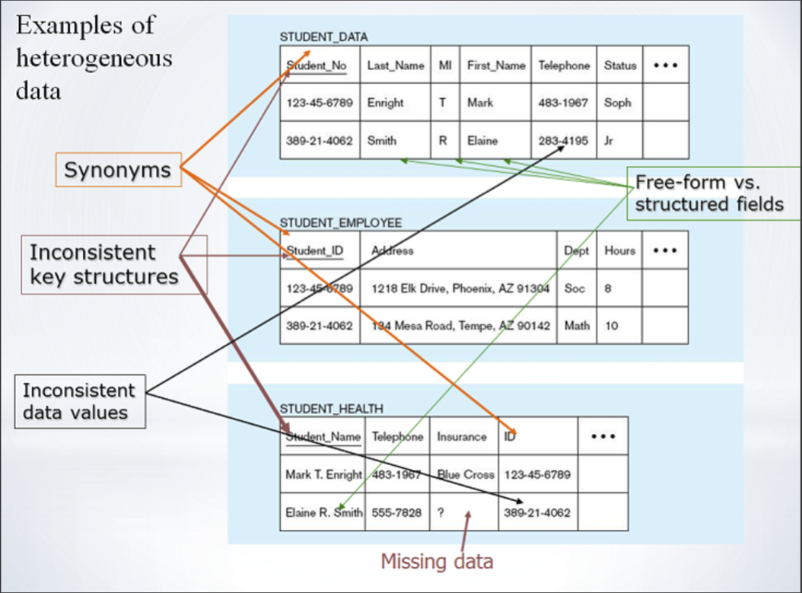
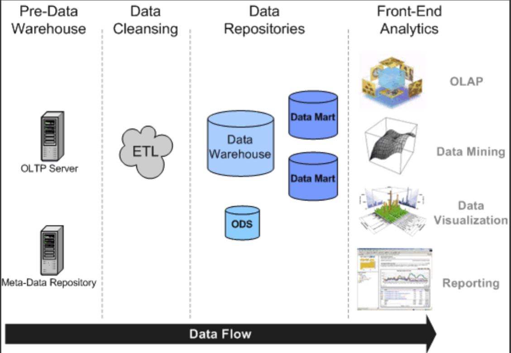
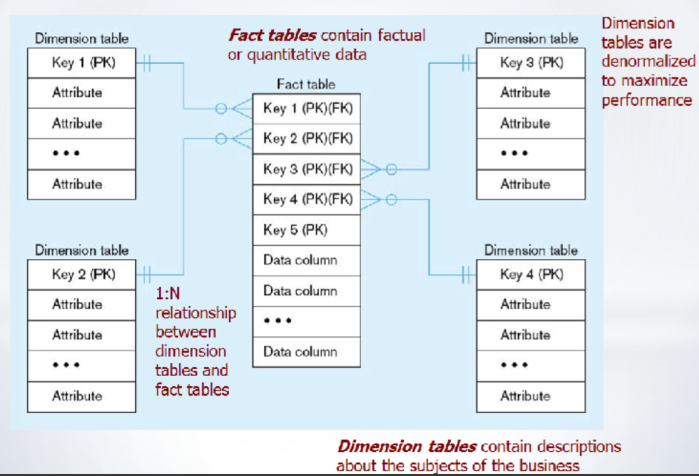
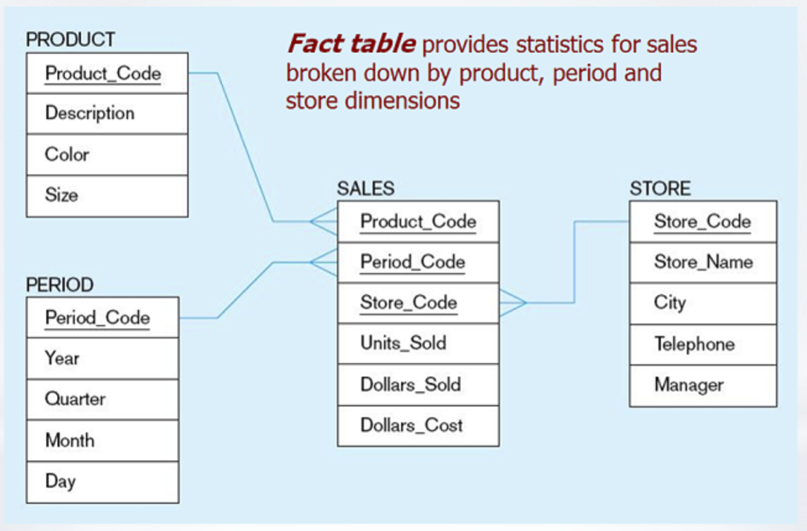
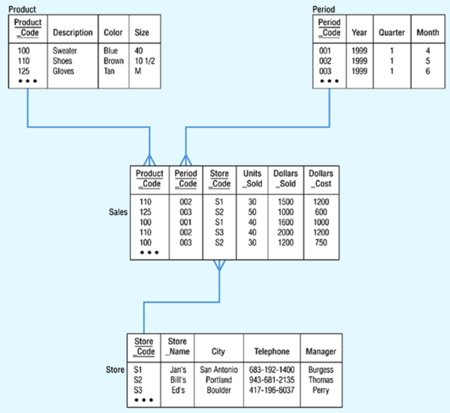

# <i class="fa fa-database"></i> INFOSYS 222
### Week 11: Data warehouse
<i class="fa fa-copyright"></i> [Johnny Chan](mailto:jh.chan@auckland.ac.nz) | <i class="fa fa-twitter"></i> [@infosys222](http://twitter.com/infosys222)


## <i class="fa fa-history"></i> Previously on 222 ...

- Database efficiency

- Transaction management

- Concurrency control


## <i class="fa fa-list-alt"></i> Agenda

- Data warehouse

- Star schema


## Data warehouse
- A [data warehouse](https://en.wikipedia.org/wiki/Data_warehouse) is a subject-oriented, integrated, time- variant, non-updatable collection of data used in support of management decision-making process

	- Subject-oriented: e.g. customer, patient, student, product
	- Integrated: consistent naming convention, format, encoding structure, multiple data source
	- Time-variant: support the study of trend and change
	- Non-updatable: read-only and periodically refreshed

- A [data mart](https://en.wikipedia.org/wiki/Data_mart) is a subset of a data warehouse that focuses on a specific business need


## Motivation
- Drowning in data but starved for information!

- Massive amount of data from business transaction
	- Most of them are unutilised or underutilised

- Improvement in IT
	- Database technology, hardware, middleware, user interface

- Intense competition for customer's attention


## Organisational trend
- No single system of record

- Multiple systems not being synchronised

- Organisational need to analyse activity in a balanced way

- Customer relationship management

- Supplier relationship management


## Example
 <!-- .element: height="600px" -->


## Creating a data warehouse
- Data Source
	- Internal and external

- Data Cleansing ([ETL](https://en.wikipedia.org/wiki/Extract,_transform,_load))
	- Data extraction
	- Data transformation
	- Data loading

- Data Repository
	- Data warehouse
	- Data mart


## Data flow
 <!-- .element: height="600px" -->


## Designing the data warehouse
- Star schema
	- Fact
	- Dimension
	- Attribute
	- Attribute hierarchy


## Star schema
 <!-- .element: height="600px" -->


## Fact and dimension
- Fact is a numeric measurement or value that represents a specific business aspect or activity

- Dimension qualifies characteristic that provides additional perspective to a given fact

- Fact and dimension tables are normally represented by physical tables in the data warehouse

- Fact table has many-to-one relationship to each dimension and subject to primary key and foreign key constraints


## Example
 <!-- .element: height="600px" -->


## Example
 <!-- .element: height="600px" -->


## Database vs data warehouse

- Database
	- Time span: represents current transaction
	- Granularity: represents specific transaction thats occur at a given time
	- Dimensionality: focuses on representing atomic transaction

- Data Warehouse
	- Time span: tends to cover long time frame
	- Granularity: presents at different levels of aggregation
	- Dimensionality: could be analysed from multiple dimensions


## Size of fact table

```
Total number of stores = 1000
Total number of products = 10000
Total number of periods = 24 (2 years worth of data)

If on average, 50% of products are sold in any given month:

Total number of rows = 1000 * 5000 * 24 = 120000000
```


## Quiz 01
- In a conversation with the general manager of Johnson and Johnson NZ, he would like you to be involved in their data warehouse project. He describes to you that the basic requirement for the data warehouse is to be able to project the sales of their products to specific customers through a particular channel. And that projection should be based on historical data of the sales

- Draw a simple star schema (with fact and dimension) that captures the requirement of the data warehouse


## Quiz 02
- Draw a star schema based on the following spec:
	- Product (__ProductID__, ProductCode, ProductName, _SubCategory_, Brand, Height, Width)
	- Category (__Category__)
	- SubCategory (__SubCategory__, _Category_)
	- Store (__StoreID__, StoreName, ParentChain, Region, Territory, Zone, Address, City, State, Zip)
	- Sale (___StoreID___, ___ProductID___, __SaleTimestamp__, SaleDollar)
	- 10 years of data with 200 stores and 3000 products on average every single day

- What would be the estimated size of the fact table?


## <i class="fa fa-list-alt"></i> Summary
- By now you have learnt:

	- the purpose and nature of data warehouse, and how it is different from a database

	- how to design a datawarehouse using star schema


## <i class="fa fa-book"></i> Reading

- Essential
	- [An Overview of Data Warehousing and OLAP Technology](https://auckland.rl.talis.com/items/EA4776AB-D603-114D-212F-B439B8D146F7.html?referrer=%2Flists%2F67385800-22DC-21D5-CBF3-00CC4AFE9E1E.html%23item-EA4776AB-D603-114D-212F-B439B8D146F7)


## <i class="fa fa-calendar"></i> Schedule
Week | Lecture | Lab
--- | --- | ---
01 | Introduction <i class="fa fa-check fa-pull-right"></i>| No lab <i class="fa fa-check fa-pull-right"></i>
02 | Relational model <i class="fa fa-check fa-pull-right"></i>| Introduction <i class="fa fa-check fa-pull-right"></i>
03 | ER modelling <i class="fa fa-check fa-pull-right"></i>| ER diagram <i class="fa fa-check fa-pull-right"></i>
04 | Data modelling <i class="fa fa-check fa-pull-right"></i> | Data modelling <i class="fa fa-check fa-pull-right"></i>
05 | Data modelling <i class="fa fa-check fa-pull-right"></i> | Workshop <i class="fa fa-check fa-pull-right"></i>
06 | Normalisation <i class="fa fa-check fa-pull-right"></i> | Normalisation <i class="fa fa-check fa-pull-right"></i>
07 | SQL <i class="fa fa-check fa-pull-right"></i> | SQL <i class="fa fa-check fa-pull-right"></i>
08 | SQL <i class="fa fa-check fa-pull-right"></i> | SQL <i class="fa fa-check fa-pull-right"></i>
09 | SQL <i class="fa fa-check fa-pull-right"></i> | SQL <i class="fa fa-check fa-pull-right"></i>
10 | DBMS fundamentals <i class="fa fa-check fa-pull-right"></i> | Workshop <i class="fa fa-check fa-pull-right"></i>
11 | Data warehouse <i class="fa fa-check fa-pull-right"></i> | Data warehouse <i class="fa fa-spinner fa-pulse fa-pull-right"></i>
12 | Review | No lab


# THE END
<canvas width=300 height=300 class="anything">
<!--
{
  "initialize": "function(container) {
	var width = container.width,
	    height = container.height;
	var projection = d3.geo.orthographic()
	    .translate([width / 2, height / 2])
	    .scale(width / 2 - 20)
	    .clipAngle(90)
	    .precision(0.6);

	var c = container.getContext('2d');

	var path = d3.geo.path()
	    .projection(projection)
	    .context(c);

	var title = container.parentElement.querySelector('.country');
	queue()
	    .defer(d3.json, '../asset/world-110m.json')
	    .defer(d3.tsv, '../asset/world-country-names.tsv')
	    .await(ready);

	function ready(error, world, names) {
	  if (error) throw error;

	  var globe = {type: 'Sphere'},
	      land = topojson.feature(world, world.objects.land),
	      countries = topojson.feature(world, world.objects.countries).features,
	      borders = topojson.mesh(world, world.objects.countries, function(a, b) { return a !== b; }),
	      i = -1,
	      n = countries.length;

	  countries = countries.filter(function(d) {
	    return names.some(function(n) {
	      if (d.id == n.id) return d.name = n.name;
	    });
	  }).sort(function(a, b) {
	    return a.name.localeCompare(b.name);
	  });

	  (function transition() {
	    d3.transition()
	        .duration(1250)
	        .each('start', function() {
			while ( !countries[i = (i + 1) % n] ) {};			
			title.innerHTML = (countries[i].name);
	        })
	        .tween('rotate', function() {
	          var p = d3.geo.centroid(countries[i]),
	              r = d3.interpolate(projection.rotate(), [-p[0], -p[1]]);
	          return function(t) {
	            projection.rotate(r(t));
	            c.clearRect(0, 0, width, height);
	            c.fillStyle = '#fff', c.lineWidth = 2, c.beginPath(), path(globe), c.fill();
	            c.fillStyle = '#42affa', c.beginPath(), path(land), c.fill();
	            c.fillStyle = '#f00', c.beginPath(), path(countries[i]), c.fill();
	            c.strokeStyle = '#ccc', c.lineWidth = .5, c.beginPath(), path(borders), c.stroke();
	            c.strokeStyle = '#ccc', c.lineWidth = 2, c.beginPath(), path(globe), c.stroke();
	          };
	        })
	      .transition()
	        .each('end', transition);
	  })();
	}

	d3.select(self.frameElement).style('height', height + 'px');

    }"
}
-->
</canvas>

#### Database rules in <span class="country">Everywhere</span>!
[<i class="fa fa-print"></i>](?print-pdf#)
